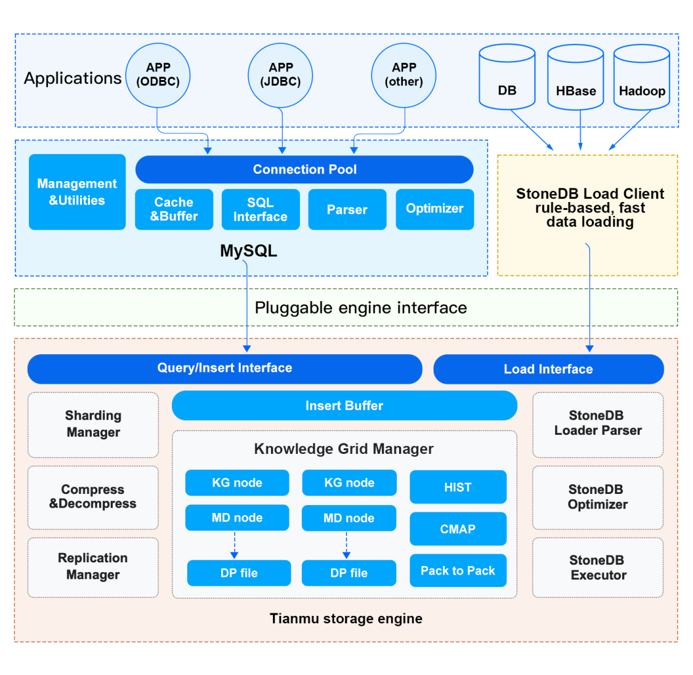

# Architecture

StoneDB is an open-source hybrid transaction/analytical processing (HTAP) database designed and developed by StoneAtom based on the MySQL kernel. It is the first database of this type launched in China. StoneDB can be seamlessly switched from MySQL. It provides features such as optimal performance and real-time analytics, offering you a one-stop solution to process online transaction processing (OLTP), online analytical processing (OLAP), and HTAP workloads.

StoneDB is fully compatible with the MySQL 5.6 and 5.7 protocols, the MySQL ecosystem, and common MySQL features and syntaxes. Tools and clients in the MySQL ecosystem, such as Navicat, Workbench, mysqldump, and mydumper, can be directly used on StoneDB. In addition, all workloads on StoneDB can be run on MySQL.

StoneDB is optimized for OLAP applications. StoneDB that runs on a common server can process complex queries on tens of billions of data records, while ensuring high performance. Compared to databases that use MySQL Community Edition, StoneDB is at least 10 times faster in processing queries.

StoneDB uses the Knowledge Grid technology and a column-based storage engine. The column-based storage engine is designed for OLAP applications and uses techniques such as column-based storage, Knowledge Grid-based filtering, and high-efficiency data compression. With such storage engine, StoneDB ensures the high performance of application systems and reduces the total cost of ownership (TCO).
## Advantages
### Full compatibility with MySQL
StoneDB is an HTAP database built on MySQL. You can use standard interfaces, such as Open Database Connectivity (ODBC) and Java Database Connectivity (JDBC) to connect to StoneDB. In addition, you can create local connections to connect to StoneDB. StoneDB supports APIs written in various programming languages, such as C, C++, C#, Java, PHP, and Perl. StoneDB is fully compatible with views and stored procedures that comply with the ANSI SQL-92 standard and the SQL-99 standard. In this way, your application systems that can run on MySQL can directly run on StoneDB, without the need to modify the code. This allows you to seamlessly switch MySQL to StoneDB.
### High query performance
When processing complex queries on tens of or even hundreds of billions of data records, StoneDB reduces the processing time to one tenth or even shorter, compared to MySQL or other row-oriented databases.
### Minimal storage cost
StoneDB supports high compression ratio which can be up to 40:1. This greatly reduces the disk space required for storing data, cutting down the TCO.
## Key techniques
### Column-based storage engine
Tables created on StoneDB are stored to disks column by column. Because data in the same column is of the same data type, the data can be densely compressed. This allows StoneDB to achieve much higher compression ratio than row-oriented databases. When processing a query that requires data in certain fields, StoneDB retrieves only the required fields, while a row-oriented database retrieves all rows that contain values of these fields. Compared to the row-oriented database, StoneDB reduces memory bandwidth traffic and disk I/O. In addition, StoneDB does not require indexing of columns, freeing from maintaining such indexes.
### High-efficiency data compression
StoneDB supports various compression algorithms, such as PPM, LZ4, B2, and Delta, and it uses different compression algorithms to compress data of different data types. After the data is compressed, the volume of the data becomes smaller, and thus less network bandwidth and disk I/O resources are required to retrieve the data. StoneDB saves storage space by using column-based storage. The data compression ratio of a column-oriented database is at least 10 times higher than that of a row-oriented database. 
### Knowledge Grid
In StoneDB, Data Packs are classified into relevant Data Packs, irrelevant Data Packs, and suspect Data Packs. This classification helps filter out irrelevant Data Packs. StoneDB needs only to read metadata of relevant Data Packs, and decompress suspect Data Packs and then examine the data records to filter relevant data records. If the result set of the relevant Data Packs can be directly obtained through their Data Pack Nodes (also known as metadata nodes), relevant Data Packs will not be decompressed. The process of handling relevant Data Packs does not consume I/O, since no data is decompressed.
### High-performance import
StoneDB provides an independent client to import data from various sources, written in different programming languages. Before data is imported, it is preprocessed, such as data compression and construction of Knowledge Nodes. In this way, operations such as parsing, verification, and transaction processing are eliminated when the data is being processed by the storage engine.
### Push-based vectorized query execution
When processing a query, StoneDB pushes column-based Data Packs from one operator to another based on the execution plan. Compared to the execution model used by row-oriented databases, push-based execution prevents in-depth calls of stacks and saves resources.