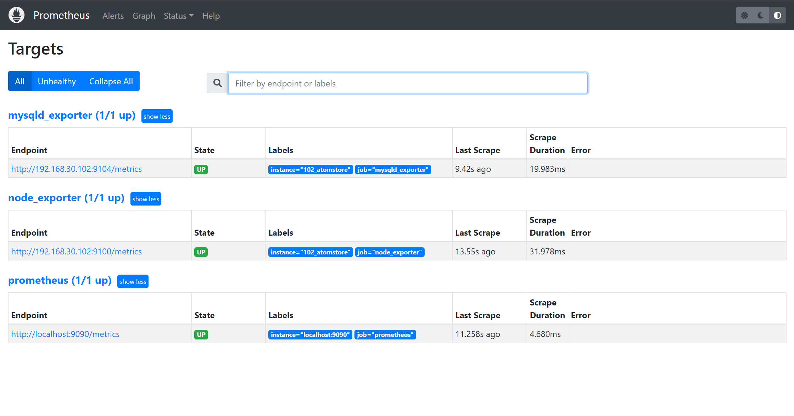
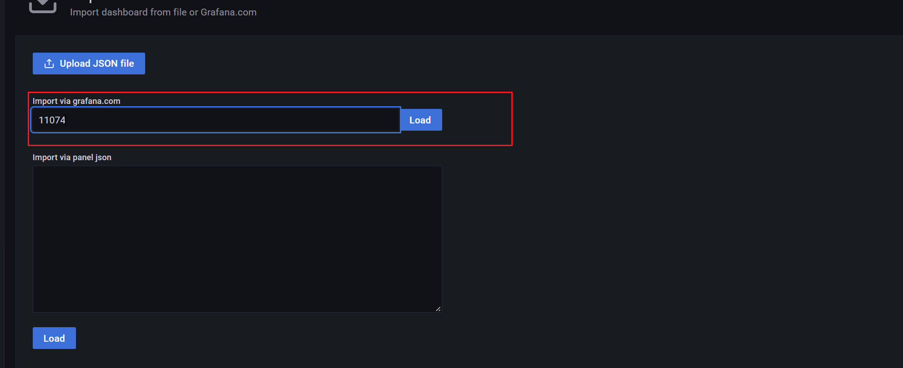
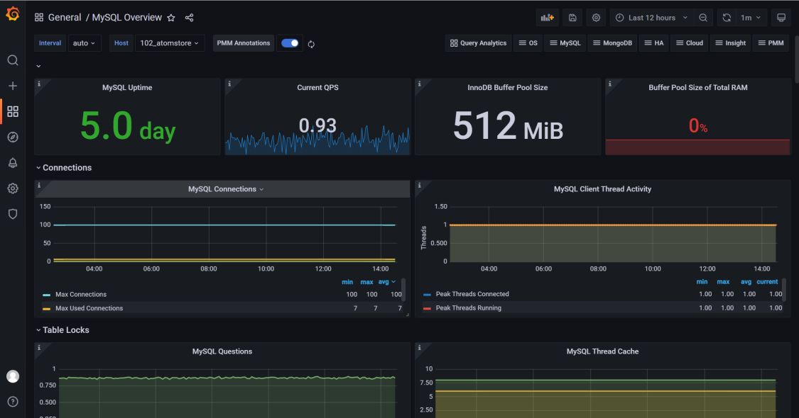

# Use Prometheus and Grafana to Monitor MySQL or StoneDB Databases

## Introduction
### Prometheus introduction
Prometheus is an open-source systems monitoring and alerting toolkit originally built at SoundCloud. Since its inception in 2012, many companies and organizations have adopted Prometheus, and the project has a very active developer and user community. It is now a standalone open-source project and independently maintained by any company. To emphasize this, and to clarity the governance structure of the project, Prometheus joined the Cloud Native Computing Foundation in 2016 as the second hosted project, after Kubernetes.

For more information about Prometheus, visit [https://prometheus.io/docs/introduction/overview/](https://prometheus.io/docs/introduction/overview/).

To download Prometheus, visit [https://prometheus.io/download/](https://prometheus.io/download/).
### Grafana introduction
Grafana is a suite of open-source visualization and analytics tools. It enables you to query, visualize, alert on, and explore your metrics, logs, and traces wherever they are stored, as well as share them to your teams. It is most commonly used to analyze and visualize time series data collected from infrastructure and applications.

For more information, visit [https://grafana.com/docs/grafana/latest/introduction/](https://grafana.com/docs/grafana/latest/introduction/).
### Environment introduction
Machine A: on which Prometheus and Grafana are deployed in Docker containers

Machine B: on which mysqld_exporter and node_exporter are deployed
#### The importance of mounting data and configuration files
In the example of this topic, Prometheus and Grafana are deployed in Docker containers. If the data and configuration files are not mounted, they may be reset when Docker containers are restarted. Therefore, to prevent the loss of monitoring data, we strongly recommend that you mount the data and configuration files. Another benefit of doing this is that you can modify the configuration file directly on the physical machine and restart the Docker container to make the modification take effect.
## **Step 1. Deploy Prometheus**

1. On machine A, start Prometheus on a Docker container. Alternatively, download the TAR package from the official site of Prometheus, extract the **data** and **prometheus.yml** files from the package, and save each file to the specified directory, for example, save **data** to directory **/home/prometheus/data** and **prometheus.yml** to directory **/home/prometheus/config**.
```shell
# Start Prometheus which is not configured with file mounting and port mapping.
docker run -d    \
prom/prometheus

mkdir -p /home/prometheus/data/
mkdir -p /home/prometheus/config/
# Copy the configuration and data files.
docker ps
docker cp 3fe0e3ea2aa5:/etc/prometheus/prometheus.yml /home/prometheus/config/
docker cp  3fe0e3ea2aa5:/prometheus /home/prometheus/data/
# You must be granted the permissions to operate on the 'data' folder. Otherwise, mapping will fail due to insufficient permissions.
chmod 777 /home/zsp/prometheus/data/*

cd /home/zsp/prometheus/
tree
.
├── config
│   └── prometheus.yml
└── data
    ├── chunks_head
    │   ├── 000001
    │   └── 000002
    ├── queries.active
    └── wal
        ├── 00000000
        └── 00000001
```

2. Start another container and configure the directories to which the data and configuration files are mounted.
```shell
docker run -d  --restart=always --name=prometheus  -p 9090:9090  \
-v /home/prometheus/config/prometheus.yml:/etc/prometheus/prometheus.yml  \
-v /home/prometheus/data/:/prometheus/     prom/prometheus \
--config.file=/etc/prometheus/prometheus.yml \
--storage.tsdb.path=/prometheus \
--web.enable-admin-api \
--web.enable-lifecycle \
--web.external-url='http://IP address of machine A:9090'  \
--storage.tsdb.retention.time=30d

```
If "http://<IP address of machine A>:9090" appears, Prometheus is successfully deployed. If the deployment fails, run the `docker logs <Container ID>` command to view logs and rectify the fault.


## Step 2. **Deploy Prometheus Exporter**
The following example shows how to monitor the OS and a MySQL database.

We recommend that you use the supervisord process to monitor Prometheus Exporter. For details about how to use supervisord, visit: [https://www.jianshu.com/p/0b9054b33db3](https://www.jianshu.com/p/0b9054b33db3).
### Deploy node_exporter

1. Download and decompress the installation package of node_exporter.
```shell
wget https://github.com/prometheus/node_exporter/releases/download/v1.3.1/node_exporter-1.3.1.linux-amd64.tar.gz
tar -zxvf node_exporter-1.3.1.linux-amd64.tar.gz
mv node_exporter-1.3.1.linux-amd64 node_exporter
mv node_exporter /usr/local/
cd /usr/local/node_exporter/
# Start node_exporter to check whether it is successfully deployed.
./node_exporter

# Start the interface again and check whether the port is open.
ss -nltp |grep 9100
LISTEN     0      128         :::9100                    :::*                   users:(("node_exporter",pid=17268,fd=3))
```

2. Use the supervisor to manage the node_exporter process.
```shell
vi /etc/supervisord.d/node_exporter.ini

[program:node_exporter]
directory = /usr/local/node_exporter/
command = /usr/local/node_exporter/node_exporter
autostart = true
startsecs = 5
autorestart = true
startretries = 3
user = root
redirect_stderr = true
stdout_logfile_maxbytes = 20MB
stdout_logfile_backups = 20
stdout_logfile = /var/log/supervisor/node_exporter.log

systemctl restart supervisord
```
### **Deploy mysqld_exporter**

1. Log in to the MySQL database on machine B and configure a MySQL monitoring account.
```shell
GRANT REPLICATION CLIENT, PROCESS ON . TO 'exporter'@'localhost' identified by 'exporter@123';
GRANT SELECT ON performance_schema.* TO 'exporter'@'localhost';
flush privileges;
```

2. Download and decompress mysqld_exporter.
```shell
wget https://github.com/prometheus/mysqld_exporter/releases/download/v0.14.0/mysqld_exporter-0.14.0.linux-amd64.tar.gz
tar -zxvf mysqld_exporter-0.14.0.linux-amd64.tar.gz
mv mysqld_exporter-0.14.0.linux-amd64 mysqld_exporter
mv mysqld_exporter /usr/local/
cd /usr/local/mysqld_exporter/
```

3. Configure the monitoring account in the** .my.cnf** file to allow the account to log in to the configuration file.
```bash
vi .my.cnf
[client]
user=exporter
password=exporter@123
```

4. Start mysqld_exporter to monitor the database.
```bash
# Test whether mysqld_exporter is working properly.
/usr/local/mysqld_exporter/mysqld_exporter --config.my-cnf=/usr/local/mysqld_exporter/.my.cnf

ss -nltp |grep 9104
LISTEN     0      128         :::9104                    :::*                   users:(("mysqld_exporter",pid=17266,fd=3))
```

5. Use Supervisor to manage the mysqld_exporter process.
```shell
cat /etc/supervisord.d/mysqld_exporter.ini

[program:mysqld_exporter]
directory = /usr/local/mysqld_exporter/
command = /usr/local/mysqld_exporter/mysqld_exporter --config.my-cnf=/usr/local/mysqld_exporter/.my.cnf
autostart = true
startsecs = 5
autorestart = true
startretries = 3
user = root
redirect_stderr = true
stdout_logfile_maxbytes = 20MB
stdout_logfile_backups = 20
stdout_logfile = /var/log/supervisor/mysqld_exporter.log

systemctl restart supervisord
```

## **Step 3. Configure Prometheus to monitor mysqld_exporter and node_exporter**

1. Complete the following configuration:
```shell
# my global config
global:
  scrape_interval: 15s # Set the scrape interval to every 15 seconds. Default is every 1 minute.
  evaluation_interval: 15s # Evaluate rules every 15 seconds. The default is every 1 minute.
  # scrape_timeout is set to the global default (10s).

# Alertmanager configuration
alerting:
  alertmanagers:
    - static_configs:
        - targets:
          # - alertmanager:9093

# Load rules once and periodically evaluate them according to the global 'evaluation_interval'.
rule_files:
  # - "first_rules.yml"
  # - "second_rules.yml"

# A scrape configuration containing exactly one endpoint to scrape:
# Here it's Prometheus itself.
scrape_configs:
  # The job name is added as a label `job=<job_name>` to any timeseries scraped from this config.
  - job_name: "prometheus"

    # metrics_path defaults to '/metrics'
    # scheme defaults to 'http'.

    static_configs:
      - targets: ["localhost:9090"]

  - job_name: "node_exporter"
    static_configs:
      - targets: ["IP address of machine B:9100"]
        labels:
          instance: IP address of machine B_stonedb

  - job_name: "mysqld_exporter"
    static_configs:
      - targets: ["IP address of machine B:9104"]
        labels:
          instance: IP address of machine B_stonedb
```

2. After mysqld_exporter and node_exporter are added, restart the Docker container to load the configuration file.
```shell
docker restart 892d640f51b2
```

3. Wait a while and view** State** on the** Targets** page of Prometheus. If the value for every metric is **up**, performance data is collected.


## **Step 4. Deploy Grafana**

1. Deploy Grafana in a Docker container.

The method to deploy Grafana is the same as the method to deploy Prometheus. You also need to mount the data and configuration files. The command to deploy Grafana is similar to that used to deploy Prometheus.
```shell
docker run -d --name=grafana -p 13000:3000 grafana/grafana
docker cp c2bfbdd0827f:/etc/grafana/grafana.ini /home/zsp/grafana/config/
docker cp c2bfbdd0827f:/var/lib/grafana/ /home/zsp/grafana/data/
tree
.
├── config
│   └── grafana.ini
└── data
    └── grafana
        ├── alerting
        │   └── 1
        │       └── __default__.tmpl
        ├── csv
        ├── grafana.db
        ├── plugins
        └── png
```

2. Start Grafana.
```shell
docker run -d  --restart=always --name=grafana  -p 13000:3000  \
-v /home/zsp/grafana/config/grafana.ini:/etc/grafana/grafana.ini  \
-v /home/zsp/grafana/data/grafana/:/var/lib/grafana/    grafana/grafana
```

3. Visit `http://<IP address of machine A>:13000` and log in to Grafana. The default username and password are **admin** and **admin**.


## **Step 5. Configure Grafana to display monitoring data from Prometheus**
### **Configure the Prometheus data source**

1. Log in to Grafana. In the left-side navigation pane, choose **Configuration** > **Data sources**.


2. In the **Time series databases** area, click **Prometheus**.


3. Configure **URL** and **Scrape Interval**.


4. Click **Save & test**. If message "Data source is working" is displayed, the data source is configured.


### **Configure Grafana Monitoring Dashboards**
On the **Configuration** page, choose **+** > **Import**, and import the official dashboards. You can customize dashboards based on your needs. 

Link to obtaining official dashboards: [https://grafana.com/grafana/dashboards/](https://grafana.com/grafana/dashboards/)

The following procedure shows how to configure dashboard 11074 to monitor node_exporter.

1. In the left-side navigation pane, choose **+** > **Import**. 


2. In the **Import via Grafana.com** text box, enter the dashboard ID and click** Load**.  In this example, the dashboard ID is 11074 which is a dashboard for monitoring OSs.



3. In the **VictoriaMetrics** drop-down list, select **Prometheus**.


The procedure to configure the monitoring dashboard for a MySQL database is similar to the previous example. 

Following are some example screenshots after the monitoring dashboard 1132 is configured.

Screenshot 1:


Screenshot 2:


