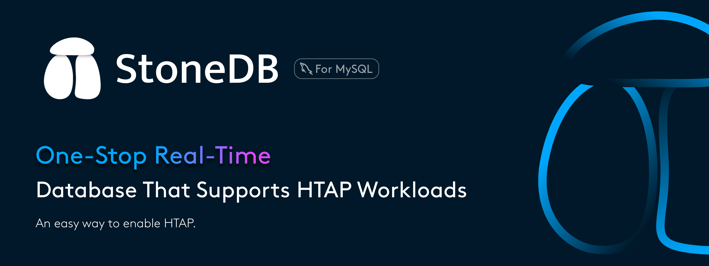

[](https://stonedb.io/)

---

[](https://github.com/stoneatom/stonedb/actions/workflows/integration-compile-mtr.yml)
[](https://github.com/stoneatom/stonedb)
[](https://stonedb.slack.com/join/shared_invite/zt-1ba2lpvbo-Vqq62DJcxViyxCZmp7Rimw#/shared-invite/email)
[](https://cms.stoneatom.com/assets/8f44fbdf-b987-44fb-8b8d-c65a37da9221.jpg)
[](https://twitter.com/intent/tweet?text=Wow:&url=https%3A%2F%2Fgithub.com%2Fstoneatom%2Fstonedb)

# Quick start with StoneDB

StoneDB is a MySQL-compatible high-performance hybrid transaction/analytical processing (HTAP) database. It provides analytical processing (AP) abilities to MySQL. The running systems can be seamlessly migrated to StoneDB without any code changed. Compared to InnoDB, StoneDB provides 10 times the query performance as well as 10 times the load performance. StoneDB also provides 10:1 to 40:1 compression ratio. 

For more information about StoneDB, see [stonedb.io](https://stonedb.io/).

# Documentation

Documentation can be found online at [https://stonedb.io](https://stonedb.io/docs/about-stonedb/intro). The documentation provides you with StoneDB basics, extensive examples of using StoneDB, as well as other information that you may need during your usage of StoneDB.

# Discussion
The [GitHub Discussions](https://github.com/stoneatom/stonedb/discussions) is the home for most discussions and communications about the StoneDB project. We welcome your participation. Every single opinion or suggestion of yours is welcomed and valued. We anticipate StoneDB to be an open and influential project.  

When participating in the StoneDB project, please ensure all your behavior complies with the [Code of Conduct](https://stonedb.io/community/main).

# Contribution
StoneDB welcomes all kinds of contributions, such as contributing code to the code base, sharing your experience on how to use StoneDB, and providing insights in the community on the Forums, or contributing to projects that make StoneDB a better project. For more specifics, see the [contributing guide](https://stonedb.io/community/main) for more specifics.
# Getting Started
The Getting Started part provides information about StoneDB supported platforms, installation (including creating your first table), and migrating from the running MySQL databases to StoneDB.
## Supported Platform
The officially supported subsets of platforms are:

- CentOS 7.9 or higher
- Ubuntu 20.04 or higher

Compiler toolsets we verify our builds with:

- GCC 7.3 or higher

The following packages we verify our builds with:

- CMake 3.16.3 or higher
- RocksDB 6.12.6 or higher
- marisa 0.2.6 or higher
## Install StoneDB
### Build StoneDB from the Source Code

**On a fresh Ubuntu 20.04 instance:**

For more information, see [Compile StoneDB on Ubuntu 20.04](https://stonedb.io/docs/developer-guide/compiling-methods/compile-using-ubuntu20.04).

**On CentOS 7.9:**

For more information, see [Compile StoneDB on CentOS 7](https://stonedb.io/docs/developer-guide/compiling-methods/compile-using-centos7).
### Build StoneDB from Source Code in a Docker Container

For more information, see [Compile StoneDB in a Docker Container](https://stonedb.io/docs/developer-guide/compiling-methods/compile-using-docker).
## Configure StoneDB
After StoneDB is installed, you need to configure at least the following parameters in the **my.cnf** file:

```
#the stonedb configuration options are listed as following.
#for an example.
[mysqld] 
default-storage-engine=stonedb
default-tmp-storage-engine=MyISAM
binlog-format=STATEMENT
```

## Initialize the Database

```bash
cd /path/to/your/path/bin && ./mysql_install_db --basedir=/stonedb/install/ --datadir=/stonedb/install/data/ --user=mysql
```

## Start the Database Instance 

```bash
mysqld_safe --defaults-file=/path/to/my.cnf 
```

or

```bash
cp /path/to/your/path/support-files/mysql.server /etc/init.d/
service mysql start
```

## Create a StoneDB Table

```sql
--The example code for creating a table with 'stonedb' engine.
CREATE TABLE `example_table` (
  `id1` bigint(20) unsigned NOT NULL DEFAULT '0',
  `id1_type` int(10) unsigned NOT NULL DEFAULT '0',
  `id2` bigint(20) unsigned NOT NULL DEFAULT '0',
  `id2_type` int(10) unsigned NOT NULL DEFAULT '0',
  `data` varchar(255) NOT NULL DEFAULT '',
  `time` bigint(20) unsigned NOT NULL DEFAULT '0',
  `version` int(11) unsigned NOT NULL DEFAULT '0',
) ENGINE=stonedb DEFAULT COLLATE=utf8mb4_general_ci;

```

The example shows some important features and limitations in StoneDB. For more information about limitations, please see [StoneDB Limitations](https://stonedb.io/docs/about-stonedb/limits). 

- StoneDB data is stored in Column format and persist to RocksDB, and RocksDB plays as a disk to store the formatted data by column. All data is compressed, and the compression ratio can be 10:1 to 40:1. 
- StoneDB can achieve a competitive performance when processing ad-hoc queries, even without any indexes created. For more details, click [here.](http://stonedb.io/)


# Now, let's exprience your StoneDB

## Switch from MySQL to StoneDB in Production

If you want to use both InnoDB and StoneDB within the same instance to run a join query, set **stonedb_ini_allowmysqlquerypath** to **1** in file **my.cnf**.

Online migration tools to move data between storage engines are not currently developed, but you obviously want this to happen without downtime, data loss, or inaccurate results. To achieve this, you need to move data logically from the source MySQL server that uses the InnoDB engine and load it into StoneDB to do analytical processing. The detailed procedure is as follows:

1. Create a StoneDB instance and tables.
2. Copy all the database and table schemas from the source to the destination.
3. Dump each table to a file by executing `SELECT … INTO OUTFILE`.
4. Send the files to the destination and load them using `LOAD DATA … INFILE`.


