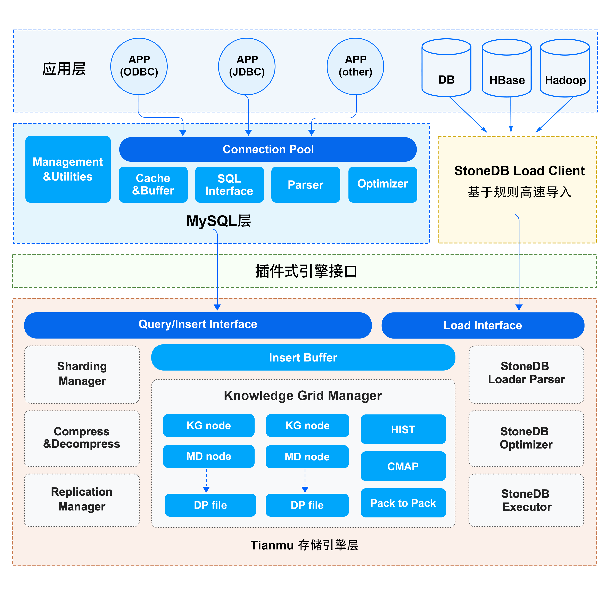

# 整体架构



StoneDB是一个HTAP数据库，其存储引擎stonedb是一个高性能、高压缩比的列式存储引擎，适用于OLAP应用。和其他的存储引擎如InnoDB、MyISAM一样，stonedb提供了存储引擎所具有的一切功能。从架构上可以看出，逻辑上分为应用层、服务层和存储引擎层。在StoneDB中，一个SQL从发起到最终返回结果，会经历每个逻辑层的不同组件。
## 应用层
### 连接管理
当客户端向服务端发起连接请求后，服务端会从线程池中分配一个线程，这个线程专门负责和这个客户端进行交互。如果客户端断开连接，这个线程也不会被立即销毁，而是被线程池回收，重新分配给新的连接，减少了创建线程和释放线程所花费的时间。
### 用户鉴权 
当客户端连接服务端后，服务端会对发起连接的用户进行鉴权处理，鉴权的依据是检查用户名、密码、IP地址及端口是否正确。如果鉴权失败，则拒绝连接。
### 安全管理 
当客户端成功连接服务端后，服务端会从权限表里根据用户的权限来判断用户具体可执行哪些操作。
## 服务层
服务层提供了数据库的逻辑功能，StoneDB会使用服务层的相关组件，如系统管理、SQL接口、查询缓存、SQL解析器。<br />注：StoneDB有自己的优化器和执行器，这里不对MySQL的优化器和执行器做介绍。
### Management & Utilities
系统管理的主要作用是提供了丰富的数据库管理功能，如备份与恢复、用户及权限管理、数据库元数据管理等。
### SQL Interface
SQL接口的主要作用是接收用户的SQL并进行处理，得到用户所需要的结果。
### Caches & buffers
查询缓存主要缓存的是SQL语句的hash值和结果集，目的是提高执行效率。当一个SQL被发起，首先会经过hash运算，如果在查询缓存命中，则直接返回，无须再通过解析、优化和执行等阶段，如果在查询缓存不能命中，则需要解析、优化和执行等阶段。然而只要表结构有变更或者表数据有更新，查询缓存就会失效。因此，生产环境建议关闭查询缓存，到了MySQL 8.0已经废弃了查询缓存功能。
### Parser
解析器的主要作用是解析SQL语句，最终生成解析树。解析器会对SQL语句进行词法解析（表、列是否存在）和语法解析（SQL语法是否正确），如果有错误，则返回相应的错误信息。
## 存储引擎层
StoneDB的存储引擎层包括数据解压缩模块、优化器、知识网格等。
### StoneDB Optimizer
StoneDB有自己的优化器，优化器会对SQL语句进行优化，如表达式转化、子查询转连接等，然后基于知识网格技术生成一个高效的执行计划。
### StoneDB Executor
根据优化器产生的执行计划读取数据。
### Knowledge Grid Manager
当数据量达到千万、亿级的时候，在做统计分析执行聚合查询的时候，原生MySQL或其它关系型数据库可能需要几分钟到几十分钟左右才能得到结果集。而StoneDB在同等的数据量和查询语句条件下，比原生MySQL或其它关系型数据库要快数十倍。主要是得益于它的列式存储、数据压缩和知识网格技术。
#### Data Pack
数据包用于存放实际数据，是最底层的数据存储单元，每列按照65536行切分成一个数据包。每个数据包比列更小，具有更高的压缩比，而每个数据包又比每行更大，具有更好的查询性能。数据包也是知识网格的解压缩单元。

根据粗糙集的概念，数据包分为以下几类：

1. 不相关的数据包：不满足查询条件的数据包

2. 相关的数据包：满足查询条件的数据包

3. 可疑的数据包：数据包中的数据部分满足查询条件，需要进一步解压缩数据包才能得到满足条件的数据行

通过对数据包的划分，知识网格技术过滤掉不相关的数据包，读取相关的数据包和可疑的数据包。其中相关的数据包不需要解压缩，只读取元数据，不会发生IO，可疑的数据包需要解压缩，会发生IO。
#### Data Pack Node
数据包节点也称为元数据节点（Metadata Node），因为数据包节点记录了每个数据包中列的最大值、最小值、平均值、总和、总记录数、null值的数量、压缩方式、占用的字节数。每一个数据包节点对应一个数据包。
#### Knowledge Node
数据包节点的上一层是知识节点，记录了数据包之间或者列之间关系的元数据集合，比如值数据包的最小值与最大值的范围、列之间的关联关系。大部分的知识节点数据是装载数据的时候产生的，另外一部分是查询的时候产生的。

知识节点的3种基本类型：
##### 1. Histogram
数据类型为整型、日期型、浮点型的列的统计信息以直方图的形式存在。将一个数据包的最小值到最大值之间分为1024段，每段占用一个bit，如果数据包中的实际值处于段中的范围，则标记为1，否则标记为0。数据被加载时，Histogram被自动创建。

如下的例子中，说明数据包中有值落在0~100和102301~102400两个区间。

| 0‒100 | 101‒200 | 201‒300 | ... | 102301‒102400 |
| --- | --- | --- | --- | --- |
| 1 | 0 | 0 | ... | 1 |

如果想要执行以下SQL：
```sql
select * from table where id>199 and id<299;
```
通过直方图可知，这个查询没有在这个数据包命中，即当前数据包不满足查询条件，这个数据包直接被丢弃。
##### 2. Character Map
数据类型为字符串的列的字符映射表。将字符串按照字符拆分，统计一个数据包内1~64长度中ASCII字符是否存在。如果存在，则标记为1，否则标记为0。数据被加载时，Character Map被自动创建。

如下的例子中，说明A在字符串的第1个和第64个位置存在。

| Char/Char pos | 1 | 2 | ... | 64 |
| --- | --- | --- | --- | --- |
| A | 1 | 0 | ... | 1 |
| B | 0 | 1 | ... | 0 |
| C | 1 | 1 | ... | 1 |
| ... | ... | ... | ... | ... |

##### 3. Pack to Pack
包对包关系表示不同表的两个列之间的等值映射表，并以二进制矩阵的形式进行存储，如果符合表关联条件，则标记为1，否则标记为0。包对包关系能帮助在表关联查询的时候快速判断出符合查询条件的数据包，从而提升表关联查询的效率。表关联查询时，Pack to Pack被自动创建。<br />如下的例子中，表关联的查询条件是"A.C=B.D"，在A.C1这个数据包中，只有B.D2和B.D5这两个数据包中有符合表关联条件的值。

|  | B.D1 | B.D2 | B.D3 | B.D4 | B.D5 |
| --- | --- | --- | --- | --- | --- |
| A.C1 | 0 | 1 | 0 | 0 | 1 |
| A.C2 | 1 | 1 | 0 | 0 | 0 |
| A.C3 | 1 | 1 | 0 | 1 | 1 |

#### Knowledge Grid
知识网格是由数据包节点和知识节点组成的。由于数据包都是压缩存放的，所以数据读取解压的代价比较高，在查询中如何做到读取尽量少的数据包是提升效率的关键。知识网格正是起到了这样的一个作用，它能够有效的过滤查询中不符合条件的数据，以最小的代价定位以数据包为最小单位的数据。知识网格的数据大小只占数据总量的1%以下，通常情况下可以加载到内存中，进一步提升查询效率。

对于大部分统计、聚合性查询，StoneDB往往只需要使用知识网格就能返回查询结果，这是因为通过知识网格可以消除或大量减少需要解压的数据包，降低IO消耗，提高查询响应时间和网络利用率。例如：数据包节点记录了最大值、最小值、平均值、总和、总记录数、null值的数量，如果想对某个列做聚合运算，那么知识网格就能根据这些元数据很快的得到结果，而无需再解压访问底层的数据包。

**通过一个例子来理解一个查询语句在存储引擎层使用知识网格技术的查询优化过程。**

有如下的查询语句和数据包节点的数据值分布范围。
```sql
select min(t2.D) from t1,t2 where t1.B=t2.C and t1.A>15;
```
|  | Min. | Max. |
| --- | --- | --- |
| t1.A1 | 1 | 9 |
| t1.A2 | 10 | 30 |
| t1.A3 | 40 | 100 |

根据列A的DPN可知，t1.A1属于不相关的数据包，t1.A2属于可疑的数据包，t1.A3属于相关的数据包，这一步就过滤掉数据包t1.A1。

|  | t2.C1 | t2.C2 | t2.C3 | t2.C4 | t2.C5 |
| --- | --- | --- | --- | --- | --- |
| t1.B1 | 1 | 1 | 1 | 0 | 1 |
| t1.B2 | 0 | 1 | 0 | 0 | 0 |
| t1.B3 | 1 | 1 | 0 | 0 | 1 |

第一步已经过滤掉数据包t1.A1，这一步就不需要对t1.B1和t2.C1做关联对比，根据包对包关系的映射表可知，这一步过滤掉数据包t2.C3和t2.C4。

那么满足关联条件的数据包有t2.C2和t2.C5。

|  | Min. | Max. |
| --- | --- | --- |
| t2.D1 | 0 | 500 |
| t2.D2 | 101 | 440 |
| t2.D3 | 300 | 6879 |
| t2.D4 | 1 | 432 |
| t2.D5 | 3 | 100 |

第一步和第二步已经过滤掉D1、D3、D4，那么只剩下D2和D5，根据列D的DPN可知，D5的最大值100小于D2的最小值101，这一步过滤掉数据包D2。最后只剩下数据包D5，只需要对数据包D5进行解压缩就能得到最终的结果。
### StoneDB Loader Parser
数据导入导出模块，即处理 LOAD DATA INFILE 与 SELECT … INTO FILE 任务。
### Insert Buffer
StoneDB的 Insert Buffer 是为整张表的插入做的优化设计，当向表插入数据时，数据先暂存到 Insert Buffer，然后再从 Insert Buffer 批量刷新到磁盘，从系统的表现来看是吞吐量提高了。如果不经过 Insert Buffer，而是直接写入磁盘，由于StoneDB不支持事务，只能一行接着一行往磁盘写入，系统的吞吐量是不高的，插入效率固然不高。Insert Buffer 由参数stonedb_insert_delayed控制，默认为on表示开启。
### Replication Manager
StoneDB复制管理模块，与MySQL的主从复制架构类似，StoneDB为了保证数据的一致性，会在Master上执行写操作，然后通过复制技术传输到Slave。与MySQL不同的是StoneDB存储引擎存储的不是原始数据，而是压缩后的数据。如果使用binlog的方式来复制，会导致网络上产生大量数据流量，为了解决这个问题，StoneDB实现了基于压缩后数据包的高效数据复制支持，相对于binlog复制，该技术可以大大降低网络传输所需的数据量。
### Compress
数据压缩模块，在StoneDB中，数据是按照列模式进行组织的，这种数据组织形式对各类压缩算法十分友好，可依据数据类型选择合适的高效压缩算法。StoneDB可以支持多达20多种自适应压缩算法，目前主要使用的有PPM、LZ4、B2、Delta等。如果列的重复值越高，压缩效果越好。数据压缩后，不仅可以节约存储成本，还可以节约IO和内存。
### Decompress
数据解压缩模块，数据压缩和解压缩的单位是数据包。知识网格技术过滤掉不相关的数据包后，对可疑的数据包需要解压缩才能得到符合查询的结果集。
