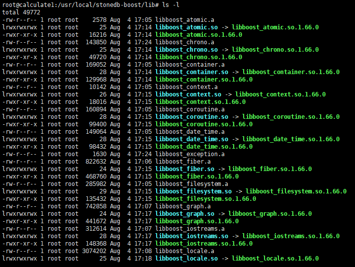

# Ubuntu 20.04 下编译 StoneDB for MySQL5.6

编译工具以及第三方库的版本要求如下。

| 编译工具及第三方库 | 版本要求 |
| --- | --- |
| gcc | 9.4.0 |
| make | 3.82 |
| cmake | 3.7.2 |
| marisa | 0.77 |
| rocksdb | 6.12.6 |
| boost | 1.66 |

## 第一步：安装依赖包
```shell
sudo apt install -y gcc
sudo apt install -y g++
sudo apt install -y make
sudo apt install -y cmake
sudo apt install -y build-essential
sudo apt install -y autoconf
sudo apt install -y tree
sudo apt install -y bison
sudo apt install -y git
sudo apt install -y libtool
sudo apt install -y numactl
sudo apt install -y python3-dev
sudo apt install -y openssl
sudo apt install -y perl
sudo apt install -y binutils
sudo apt install -y libgmp-dev
sudo apt install -y libmpfr-dev
sudo apt install -y libmpc-dev
sudo apt install -y libisl-dev
sudo apt install -y zlib1g-dev
sudo apt install -y liblz4-dev
sudo apt install -y libbz2-dev
sudo apt install -y libzstd-dev
sudo apt install -y zstd
sudo apt install -y lz4
sudo apt install -y ncurses-dev
sudo apt install -y libsnappy-dev
sudo apt install -y libedit-dev
sudo apt install -y libaio-dev
sudo apt install -y libncurses5-dev 
sudo apt install -y libreadline-dev
sudo apt install -y libpam0g-dev
sudo apt install -y zlib1g-dev
sudo apt install -y libicu-dev
sudo apt install -y libboost-dev
sudo apt install -y libgflags-dev
sudo apt install -y libjemalloc-dev
sudo apt install -y libssl-dev
sudo apt install -y pkg-config
```
注：依赖包必须都装上，否则后面有很多报错。

## 第二步：安装第三方库
安装第三库前需要确认 cmake 版本是3.7.2以上，make 版本是3.82以上，如果低于这两个版本，需要进行安装。StoneDB 依赖 marisa、rocksdb、boost，在编译 marisa、rocksdb、boost 时，建议指定安装路径。示例中我们指定了 marisa、rocksdb、boost 的安装路径。

### 1. 安装 cmake
```shell
wget https://cmake.org/files/v3.7/cmake-3.7.2.tar.gz
tar -zxvf cmake-3.7.2.tar.gz
cd cmake-3.7.2
./bootstrap && make && make install
/usr/local/bin/cmake --version
apt remove cmake -y
ln -s /usr/local/bin/cmake /usr/bin/
cmake --version
```
### 2. 安装 make
```shell
wget http://mirrors.ustc.edu.cn/gnu/make/make-3.82.tar.gz
tar -zxvf make-3.82.tar.gz
cd make-3.82
./configure  --prefix=/usr/local/make
make && make install
rm -rf /usr/local/bin/make
ln -s /usr/local/make/bin/make /usr/local/bin/make
make --version
```
### 3. 安装 marisa 
```shell
git clone https://github.com/s-yata/marisa-trie.git
cd marisa-trie
autoreconf -i
./configure --enable-native-code --prefix=/usr/local/stonedb-marisa
sudo make && make install 
```
marisa 的安装路径可以根据实际情况指定，示例中的安装路径是 /usr/local/stonedb-marisa。此步骤会在 /usr/local/stonedb-marisa/lib 下生成如下目录和文件。


### 4. 安装 rocksdb 
```shell
wget https://github.com/facebook/rocksdb/archive/refs/tags/v6.12.6.tar.gz 
tar -zxvf v6.12.6.tar.gz
cd rocksdb-6.12.6

sudo cmake ./ \
  -DCMAKE_BUILD_TYPE=Release \
  -DCMAKE_INSTALL_PREFIX=/usr/local/stonedb-gcc-rocksdb \
  -DCMAKE_INSTALL_LIBDIR=/usr/local/stonedb-gcc-rocksdb \
  -DWITH_JEMALLOC=ON \
  -DWITH_SNAPPY=ON \
  -DWITH_LZ4=ON \
  -DWITH_ZLIB=ON \
  -DWITH_ZSTD=ON \
  -DUSE_RTTI=ON \
  -DROCKSDB_BUILD_SHARED=ON \
  -DWITH_GFLAGS=OFF \
  -DWITH_TOOLS=OFF \
  -DWITH_BENCHMARK_TOOLS=OFF \
  -DWITH_CORE_TOOLS=OFF 

sudo make -j`nproc`
sudo make install -j`nproc`
```
rocksdb 的安装路径可以根据实际情况指定，示例中的安装路径是 /usr/local/stonedb-gcc-rocksdb。此步骤会在 /usr/local/stonedb-gcc-rocksdb 下生成如下目录和文件。


### 5. 安装 boost
```shell
wget https://sourceforge.net/projects/boost/files/boost/1.66.0/boost_1_66_0.tar.gz
tar -zxvf boost_1_66_0.tar.gz
cd boost_1_66_0
./bootstrap.sh --prefix=/usr/local/stonedb-boost
./b2 install --with=all
```
boost 的安装路径可以根据实际情况指定，示例中的安装路径是 /usr/local/stonedb-boost。此步骤会在 /usr/local/stonedb-boost/lib 下生成如下目录和文件。



:::info
在编译过程中，除非有关键字 "error" 报错自动退出，否则出现关键字 "warning"、"failed"是正常的，安装 boost 大概需要25分钟左右。
:::

## 第三步：执行编译
StoneDB 现有 5.6 和 5.7 两个分支，下载的源码包默认是 5.7 分支。下载的源码包存放路径可根据实际情况指定，示例中的源码包存放路径是在根目录下，并且是切换为 5.6 分支的编译安装。
```shell
cd /
git clone https://github.com/stoneatom/stonedb.git
cd stonedb
git checkout remotes/origin/stonedb-5.6
```
在执行编译脚本前，需要修改编译脚本的两处内容：<br />1）StoneDB 安装目录，可根据实际情况修改，示例中的安装目录是 /stonedb56/install；<br />2）marisa、rocksdb、boost 的实际安装路径，必须与上文安装 marisa、rocksdb、boost 的路径保持一致。
```shell
###修改编译脚本
cd /stonedb/scripts
vim stonedb_build.sh
...
install_target=/stonedb56/install
...
-DDOWNLOAD_BOOST=0 \
-DWITH_BOOST=/usr/local/stonedb-boost/ \
-DWITH_MARISA=/usr/local/stonedb-marisa \
-DWITH_ROCKSDB=/usr/local/stonedb-gcc-rocksdb \
2>&1 | tee -a ${build_log}

###执行编译脚本
sh stonedb_build.sh
```
:::info
如果是 CentOS/RedHat ，需要注释 os_dist 和 os_dist_release，并且修改 build_tag ，这是因为 "lsb_release -a" 返回的结果中，Distributor、Release、Codename 显示的是 n/a。注释 os_dist 和 os_dist_release 只会影响产生的日志名和 tar 包名，不会影响编译结果。
:::
## 第四步：启动实例
用户可按照手动安装和自动安装两种方式启动 StoneDB。
### 1. 创建用户
```shell
groupadd mysql
useradd -g mysql mysql
passwd mysql
```
### 2. 手动安装 
编译完成后，如果 StoneDB 安装目录不是 /stonedb56，不会自动生成 reinstall.sh、install.sh 和 my.cnf 文件，需要手动创建目录、初始化和启动实例。还需要配置 my.cnf 文件，如安装目录，端口等参数。
```shell
###创建目录
mkdir -p /data/stonedb56/install/data/innodb
mkdir -p /data/stonedb56/install/binlog
mkdir -p /data/stonedb56/install/log
mkdir -p /data/stonedb56/install/tmp
chown -R mysql:mysql /data

###配置my.cnf
vim /data/stonedb56/install/my.cnf
[mysqld]
port      = 3306
socket    = /data/stonedb56/install/tmp/mysql.sock
datadir   = /data/stonedb56/install/data
pid-file  = /data/stonedb56/install/data/mysqld.pid
log-error = /data/stonedb56/install/log/mysqld.log

chown -R mysql:mysql /data/stonedb56/install/my.cnf

###初始化实例
/data/stonedb56/install/scripts/mysql_install_db --datadir=/data/stonedb56/install/data --basedir=/data/stonedb56/install --user=mysql

###启动实例
/data/stonedb56/install/bin/mysqld_safe --defaults-file=/data/stonedb56/install/my.cnf --user=mysql &
```
### 3. 自动安装
编译完成后，如果 StoneDB 安装目录是 /stonedb56，会自动生成 reinstall.sh、install.sh 和 my.cnf 文件，执行 reinstall.sh 就是创建目录、初始化实例和启动实例的过程。
```shell
cd /stonedb56/install
./reinstall.sh
```
:::info
reinstall.sh 与 install.sh 的区别？<br />reinstall.sh 是自动化安装脚本，执行脚本的过程是创建目录、初始化实例和启动实例的过程，只在第一次使用，其他任何时候使用都会删除整个目录，重新初始化数据库。install.sh 是手动安装提供的示例脚本，用户可根据自定义的安装目录修改路径，然后执行脚本，执行脚本的过程也是创建目录、初始化实例和启动实例。以上两个脚本都只能在第一次使用。
:::
### 4. 执行登录
```shell
/stonedb56/install/bin/mysql -uroot -p -S /stonedb56/install/tmp/mysql.sock
Enter password: 
Welcome to the MySQL monitor.  Commands end with ; or \g.
Your MySQL connection id is 2
Server version: 5.6.24-StoneDB-debug build-

Copyright (c) 2000, 2022 StoneAtom Group Holding Limited
Type 'help;' or '\h' for help. Type '\c' to clear the current input statement.

mysql> show databases;
+--------------------+
| Database           |
+--------------------+
| information_schema |
| cache              |
| innodb             |
| mysql              |
| performance_schema |
| sys_stonedb        |
| test               |
+--------------------+
7 rows in set (0.00 sec)
```
